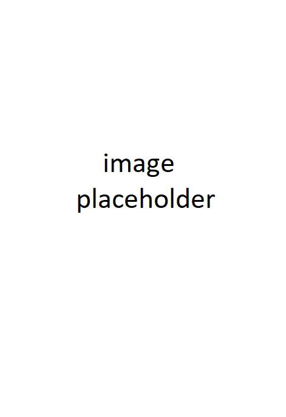

# About
  

My name is Cameron Levine, and I’m a video game programmer from Wisconsin. I am currently attending UW-Whitewater for a major in Computer Science, and will be graduating in May of 2022. Most of the experience I have is coding with C# in Unity, but I also have experience programming in C++, Java, and HTML/CSS. I’m open for work, and if you’d like to contact me, send me a message on my email or LinkedIn.  

