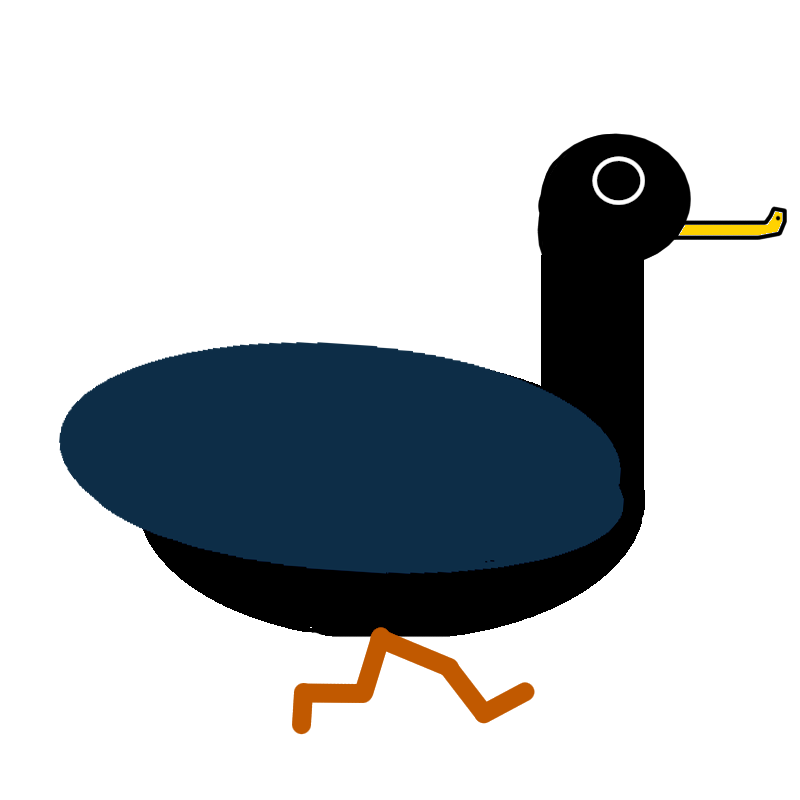

<link rel="shortcut icon" type="image/x-icon" href="./images/favicon.ico">

<h1 id="titleSection"></h1>

# Duck Warrior

<iframe src="https://itch.io/embed/1020257" height="167" width="552" frameborder="0"><a href="https://cameronlevine.itch.io/duck-warrior">Duck Warrior by cameronlevine</a></iframe>

Duck Warrior is a 2D platformer where you control a duck with a knife strapped to his chest attempting to get his hat back. Each stage is an arena, where you have to kill waves of enemies before facing off against a boss. It was a fun project with an absurd concept that made my first game in Unity a memorable one.


The starting inspiration for Duck Warrior was the game “Joust”, an Atari game where you joust on an ostrich. From this, we derived two things: ramming into enemies in order to kill them, and birds. Unlike its inspiration, however, Duck Warrior focuses less on 1v1 battles against similar enemies and focuses more on level progression and boss fights. 

<iframe width="560" height="315" src="https://www.youtube.com/embed/ouqM6Q7Ffyk" title="YouTube video player" frameborder="0" allow="accelerometer; autoplay; clipboard-write; encrypted-media; gyroscope; picture-in-picture" allowfullscreen></iframe>

In the spirit of the game’s bird theme, we wanted to make the player’s jumping fluttery. By making the jumps short and quick, we managed to not only simulate the flapping of wings, but to also give the player finer control while jumping. Speed was also an important aspect, since the way to kill enemies is by ramming into them, so the controls needed to feel fast but not uncontrollable.

```C#
void Update()
    {
        Move(new Vector2(Input.GetAxisRaw("Horizontal"), Input.GetAxisRaw("Vertical"))); //get keyboard input for player movement
        FlipSprite(); //flip player sprite in accordance to which direction they should be facing
    }
```

<iframe width="560" height="315" src="https://www.youtube.com/embed/dHgzYQ4i3-o" title="YouTube video player" frameborder="0" allow="accelerometer; autoplay; clipboard-write; encrypted-media; gyroscope; picture-in-picture" allowfullscreen></iframe>

The general design of the game was to be set in arena levels where the player must defeat all the enemies before taking on the boss. Spawning in new enemies after the initial enemies allowed for the fairly compact levels to still throw new obstacles at the player, and to provide a greater challenge. 


The enemies either patrol an area of the level, or chase after the player. While the first level’s enemies are the least threatening, with their weapons at a fixed position, the second and third level’s enemies swing their weapons, making them a bigger threat. 

<iframe width="560" height="315" src="https://www.youtube.com/embed/Xb2TY1SBMlI" title="YouTube video player" frameborder="0" allow="accelerometer; autoplay; clipboard-write; encrypted-media; gyroscope; picture-in-picture" allowfullscreen></iframe>

Designing the bosses was a highlight for me, as coming up with new ways to make each boss fight different and challenging was fun. Each boss requires a different strategy to defeat it, with each boss being harder than the last, culminating with a multi-phase final boss fight. 

<hr>

<div style="text-align: center;">
  <a href="mailto:chaotixlevine@gmail.com"></a>
  <a href="https://www.linkedin.com/in/cameron-levine-930242214"></a>
</div>
