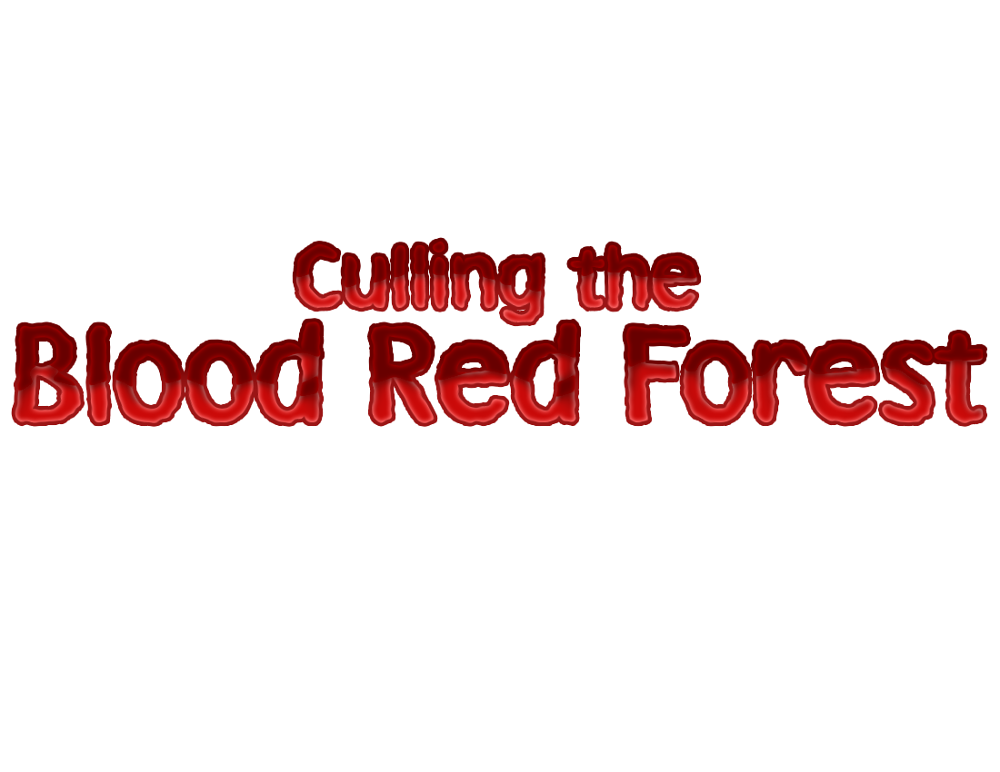
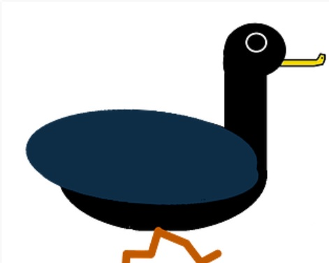

# Games {#gameSection} 
 

## [Culling the Blood Red Forest](https://cameronsjlevine.github.io/cullingTheBloodRedForest)

Culling the Blood Red Forest is a 3D shooter where you speed around stages killing semi-aggressive forest creatures. Beating the boss at the end of a stage earns you a new gun to try out, giving you even more ways to succeed.

## [Duck Warrior](https://cameronsjlevine.github.io/duckWarrior)

Duck Warrior is a 2D platformer where you control a duck with a knife strapped to his chest attempting to get his hat back. Each stage is an arena, where you have to kill waves of enemies before facing off against a boss. It was a fun project with an absurd concept that made my first game in Unity a memorable one.  

# About {#aboutSection}
[image](./images/aboutSectionPicture.jpg)
