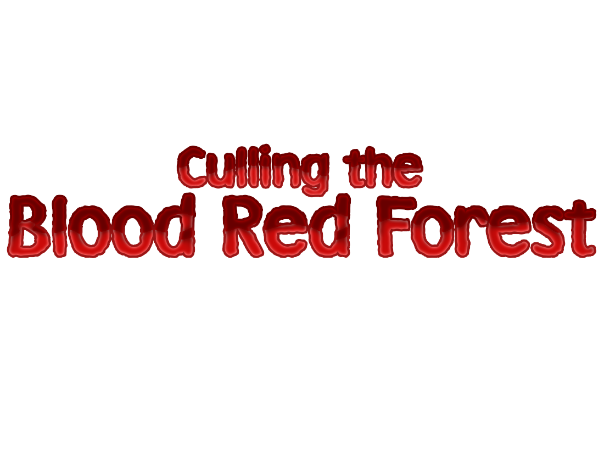

<link rel="shortcut icon" type="image/x-icon" href="./images/favicon.ico">

My name is Cameron Levine, and this is my video game development portfolio. Here you will find information on some of the projects I have worked on in the past, detailing my experiences in making games. You can also find my [resume](https://cameronsjlevine.github.io/resumeOld/#titleSection) for a more condensed and formal version of my experience, as well as a brief section [about me](https://cameronsjlevine.github.io/aboutOld/#titleSection). To return to the up-to-date site, [click here](https://cameronsjlevine.github.io).

<h1 id="gameSection"></h1>   

## [Duck Warrior](https://cameronsjlevine.github.io/duckWarriorOld/#titleSection)

- Duck Warrior is a 2D platformer
- Programming, game design, and implementing assets into Unity were my responsibilities
- Art, sound effects, and music done by Spencer Carey
 
## [Culling the Blood Red Forest](https://cameronsjlevine.github.io/cullingTheBloodRedForestOld/#titleSection)

- Culling the Blood Red Forest is a 3D shooter
- Programming was done by me, as well as some of the implementation of assets in Unity
- Testing and implementation done by Joshua T. Fugate, 3D models and UI done by Charles Quinn, and sound effects/music done by Ethan D. Greening
 

  
  

